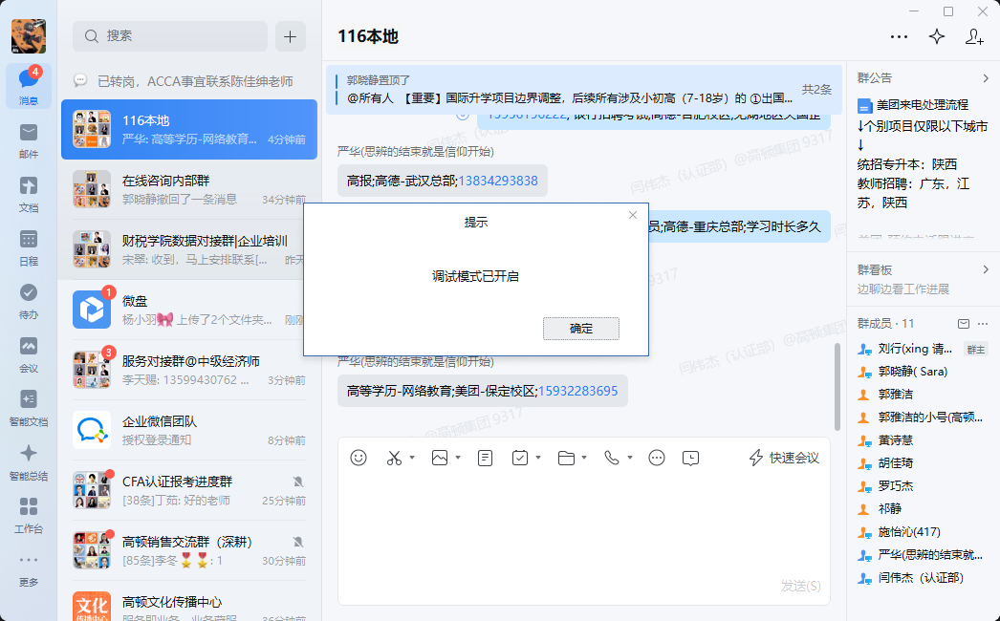
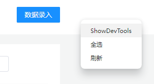
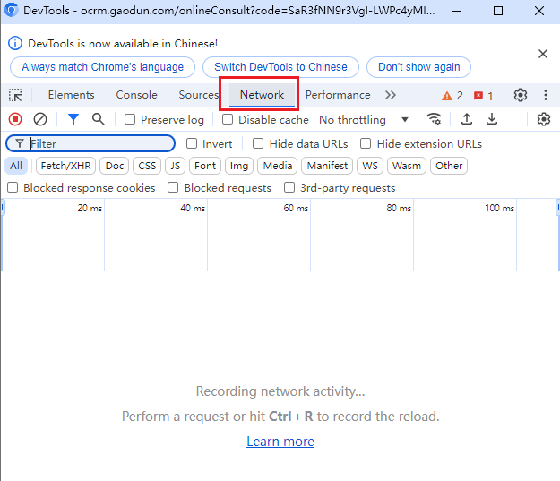
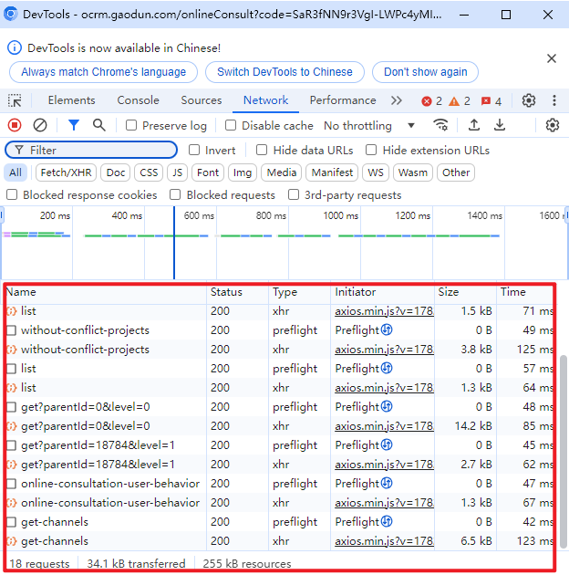
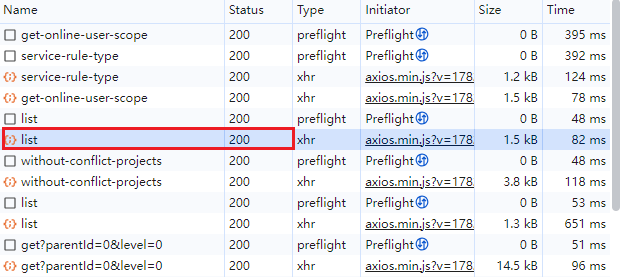
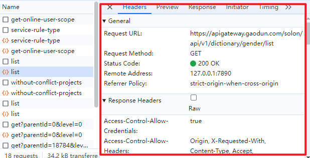
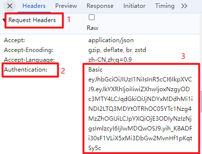

1.打开企微，同时按`shift`+`ctrl`+`alt`+`D`，进入调试模式
  

2.打开数据录入界面，右键空白处，点击 ShowDevTools
  

3.发现打开一个小窗口，选中 Network
  

4.此时再点一下“数据录入”按钮，切回小窗口看一下，发现多了很多东西
  

5.在小窗口里找一个带橙色图标的行，点一下，发现跳出详情
  
  

6.依次找到`Request Headers`,`Authentication`，旁边会有一个 Basic 开头的字符串，这就是我们要找的，复制下来粘贴即可
  

7. **复制时注意不要多复制空格回车**
